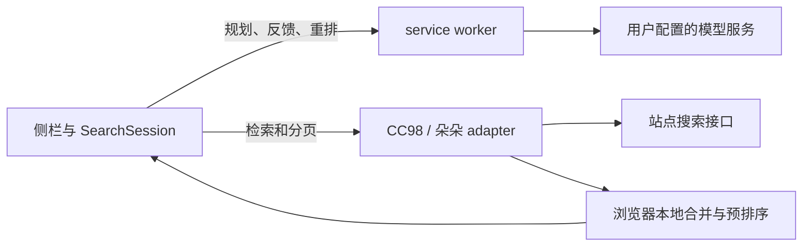

# ZJU Forum Search

在 CC98 页面用自然语言找帖子。这个 Manifest V3 浏览器扩展会让用户配置的 OpenAI 兼容模型规划检索词，再调用站点搜索接口；候选合并和本地预排序都在浏览器中完成，不需要运行本地后端。

| 站点入口 | 当前状态 |
| --- | --- |
| CC98 直连 | 主要使用场景。需要先在原站登录。 |
| CC98 WebVPN 映射页 | 已接入；需先登录 WebVPN 和 CC98。桥接限流改动仍待真实会话复验。 |
| 朵朵校友圈 | 试验性接入，检索适配仍在完善。 |

## 动态演示

> 演示录屏待上传。建议展示输入查询、逐轮检索进度、结果列表及原帖跳转；录制时隐藏账号信息和 API key。

<!-- 上传演示文件后，在此处嵌入图片或视频，并删去上面的占位文字。 -->

## 安装

推荐从[最新 Release](https://github.com/kenqia/zju-forum-search/releases/latest)下载扩展：

1. 下载发布页附件中的扩展 ZIP 并解压，找到其中的 `dist/` 文件夹。
2. 在 Edge 打开 `edge://extensions`，启用“开发人员模式”，点击“加载解压缩的扩展”，选择解压后的 `dist/`。
3. 登录 [CC98](https://www.cc98.org/) 并刷新页面。右下角会出现“搜”悬浮球；点击浏览器扩展图标也能打开侧栏。

通过学校 WebVPN 访问时，先登录 WebVPN 和 CC98，再打开 [CC98 映射页面](https://webvpn.zju.edu.cn/https/77726476706e69737468656265737421e7e056d22433310830079bab/)并刷新。若扩展提示无法复用登录态，可改用校园网或 RVPN 直连。WebVPN 桥接的权限和限制见[检索行为与实现边界](docs/search-behavior.md#登录与-webvpn)。

### 从源码构建

如需自行构建，先安装 Node.js 和 npm，再在仓库根目录运行：

```bash
cd frontend
npm ci
npm run build
```

构建产物位于 `frontend/dist/`，按上面的步骤加载该文件夹。

## 使用

1. 在侧栏“设置”中填写模型的 base URL、API key 和模型名称，点击“保存”。浏览器会请求该模型主机的访问权限，用于让扩展向它发送模型请求。这是站点访问授权，不是密码管理器提示。
2. 回到“搜索”，输入自然语言问题，例如“近两年的微积分历年卷”，然后提交。
3. 查看逐轮出现的结果，点击标题打开原帖。需要提前结束站点检索时，可点击“停止并查看结果”；再次提交查询会开始一次新搜索。

扩展复用当前站点登录态，没有论坛账号输入入口。若登录已过期，先在原站重新登录并刷新页面。搜索达到请求上限、遇到错误或被手动停止时，侧栏会保留已找到的结果并说明停止原因。

## 设置说明

设置入口在搜索侧栏的“设置”页。数值项会限制在下表范围内；开始新搜索时会读取当前设置。

| 设置 | 默认值 | 含义 |
| --- | --- | --- |
| OpenAI 兼容 base URL | `https://dashscope.aliyuncs.com/compatible-mode/v1` | 模型服务地址。扩展请求其 `/chat/completions` 接口；保存时申请该主机的访问权限。 |
| API key | 空，必须填写 | 模型服务的密钥，输入时遮挡，保存在浏览器的 `chrome.storage.local`。 |
| 模型名称 | `qwen3.8-27b` | 传给模型服务的模型 ID；应按所用服务的实际名称填写。 |
| 站点请求上限 | 30，可设 1–100 | 一次搜索最多发出的站点搜索请求数，包含翻页；模型调用不计入。 |
| 单轮反馈证据 | 30，可设 10–100 | 一次模型反馈最多选择的候选数；负载大小限制可能使实际数量更少。 |
| 允许模型提前收窄搜索范围 | 关闭 | 开启后，模型可建议停止后续扩展或某个检索词的翻页；站点请求上限始终有效。 |
| 搜索完成后优化结果顺序 | 开启 | 让模型对前排结果做一次最终重排；失败或取消时保留本地顺序。 |
| 重排候选 Top-M | 30，可设 10–150 | 最终重排最多选取本地预排序靠前的 M 条主结果。 |

## 工作方式



侧栏按当前页面选择站点 adapter。adapter 处理站点登录态、请求和分页；service worker 调用模型。详细的检索波次、停止条件、排序规则和新增搜索源的约定见[检索行为与实现边界](docs/search-behavior.md)。领域术语见 [CONTEXT.md](CONTEXT.md)，设计取舍见 [ADRs](docs/adr/)。

## 隐私与使用边界

- 首轮模型调用会发送查询和当前日期。后续调用可能发送已执行的检索词、检索统计，以及候选的原生标题、发布时间、板块和回复数。作者、正文、回帖、帖子 URL 和论坛登录信息不会发送给模型；朵朵的正文派生标题仅在本地显示。
- API key 保存在 `chrome.storage.local`，该存储不加密。扩展会用 key 向所配置的模型服务鉴权，但不会把 key 回传给 content script。请查看模型服务提供方的数据处理与计费规则。
- 本扩展只检索当前账号可访问的站点内容。请求上限、模型判断、网络故障和站点限流都可能让结果不完整；请以原帖内容为准。
- 本项目是独立浏览器扩展，文档内容不代表 CC98、朵朵校友圈或浙江大学的官方声明。站点接口、登录方式或模型服务的兼容性发生变化时，扩展可能需要更新。朵朵检索仍处于试验性验证阶段。

WebVPN 桥接存在同页面脚本可触发桥接事件的边界，详见[登录与 WebVPN](docs/search-behavior.md#登录与-webvpn)。

## 开发与验收

```bash
cd frontend
npm test
npm run typecheck
npm run build
```

浏览器内的人工检查入口和各阶段验收向导见[手动验收](docs/manual-acceptance.md)。
